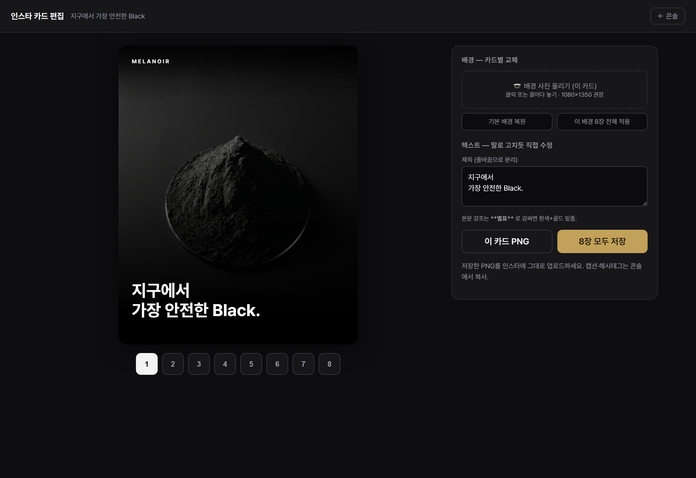
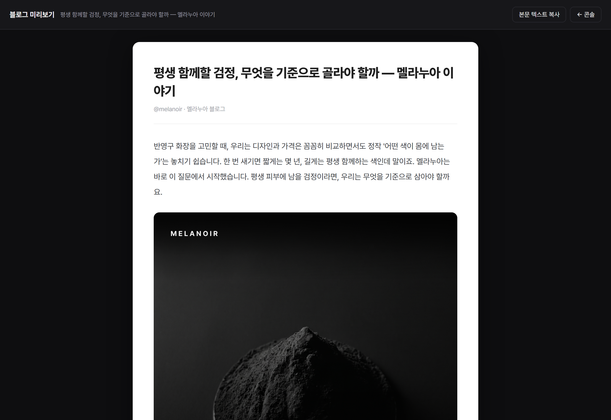

# 멜라누아 스튜디오 — 설치 안내 (macOS · Claude Desktop)

> 매일 **명령 한 줄**로 5채널 콘텐츠를 만들고, 웹에서 **검토·복붙**합니다. 1회 설치 ~15분.

## 0. 준비물
- macOS + **Claude Desktop**(구독) — Cowork / Claude Code 사용 중
- **Node.js 18+** — 없으면 [nodejs.org](https://nodejs.org) 에서 LTS 설치
- **Supabase 키** — Totaro가 전달 (`.env.local` / `config.js` 값)

---

## 1. 스킬 등록 (5분)
1. Claude Desktop → **설정 → 커스터마이징 → Skills**
2. **`+` → "스킬 만들기" → `melanoir-skill.zip` 업로드** → 토글 **ON**
   (ZIP은 엔진 레포 루트의 `melanoir-skill.zip`)
3. **설정 → Capabilities → "코드 실행 및 파일 생성" ON** (스킬이 엔진을 돌리려면 필요)

---

## 2. 엔진 설치 (한 방, 10분)
Cowork(또는 터미널)에서:
```bash
git clone https://github.com/Totaro-int/marketing_m.git melanoir-studio
cd melanoir-studio
node scripts/setup.mjs        # 설정 템플릿 복사 + npm install + 점검
```
그다음 **`.env.local`** 과 **`web/config.js`** 에 Totaro가 준 키를 붙여넣고:
```bash
npm run doctor                # ✓ "준비 완료" 뜨면 끝
```

> `canvas`(서버 렌더)는 설치 안 돼도 됩니다 — 인스타 카드는 **웹 카드 편집기**가 그립니다.

### 2-1. 🔑 키 채우기 & 전달
넣을 값 3개 = **Supabase 대시보드 → Project Settings → API** 에서 복사:

| 값 | 넣는 곳 |
|---|---|
| Project URL | `.env.local` + `web/config.js` |
| anon public key | `.env.local` + `web/config.js` (공개키 — RLS로 보호) |
| service_role key | **`.env.local` 에만** (⚠️ 전체 DB 권한 — 공개 절대 금지) |

- **본인 맥(지금)**: 맥에서 대시보드 값으로 `.env.local` 만 채우면 → `npm run setup`(또는 `npm run gen:config`)이 **`web/config.js` 를 자동 생성**합니다. (config.js 따로 안 만들어도 됨)
- **클라이언트에게 넘길 때**: **`.env.local` 파일을 그대로 비공개로 전달**하면 됩니다(USB·비공개 드라이브 공유·DM 첨부 등). 신뢰하는 클라 1명에게 비공개로 주는 건 OK. **금지는 딱 하나 — 공개 노출**(공개 레포 커밋·공개 링크·공개 게시판).
  - **메일로 보낼 때**: `.env.local` + `web/config.js` 두 파일 첨부 + **키 설치 안내(`KEY-SETUP.pdf`)** 동봉 → 클라가 제자리에 넣고 **메일 삭제(받은함+휴지통)**, 보낸 사람도 보낸함에서 삭제. (메일은 영구 보관되니 service_role은 *넣은 뒤 반드시 삭제*.)

### 2-2. 자사몰 인사이트 자동 발행 설정 (선택)
인사이트를 **명령 한 줄로 melanoir.co.kr/insights 에 자동 게시**하려면:
1. 자사몰 레포를 **쓰기 권한 계정**으로 클론 — `git clone <자사몰-레포> melanoir-recruitment`
2. `.env.local` 에 경로 추가 — `MELANOIR_SITE_REPO=/경로/melanoir-recruitment/web/site/insights`

→ 이후 **`/melanoir`** 발행 시 **GEO/SEO 정적 아티클**(텍스트 본문 + JSON-LD + sitemap + llms.txt)을 자사몰 레포에 **git push → Vercel 배포**, 그리고 **IndexNow로 네이버·Bing·ChatGPT 즉시 색인 통보**. (구글은 sitemap 자동 크롤 + 1회 `/totaro-seo`로 Search Console 등록 권장 · 미설정이면 콘솔에서 확인만)

---

## 3. 스킬 사용법 (매일)
작업 폴더 = **`melanoir-studio`** 로 Cowork / Claude Code 를 연 상태에서, **말로** 시키면 됩니다.

### 3-1. 생성 — 명령 하나 `/melanoir`
작업 폴더를 연 채 **`/melanoir`** 한 줄이면 끝 (오늘 자동 토픽 → 5채널 전체).

| 명령 | 결과 |
|---|---|
| **`/melanoir`** | 오늘 자동 토픽으로 **5채널 전체** |
| `/melanoir 6` | 6번 토픽으로 |
| `/melanoir 97% 세포생존율` | 특정 주제로 |
| `/melanoir 카드` | 인스타 카드만 |
| `/melanoir 다음` | 다음 토픽 확인 |

> 슬래시 명령이 안 먹는 환경이면 **"오늘 콘텐츠"**라고 말해도 똑같이 실행됩니다.

→ 스킬이 자동으로: **어제 피드백 학습 → 토픽 선택 → 5채널 골드 카피 작성(구독, 비용 0) → 브랜드·광고법 가드 → 미리보기**.

### 3-2. 검토 → 발행 (한 박자 게이트)
Claude가 5채널 초안을 보여주면:
- 그대로 OK → **"발행해줘"** / "콘솔에 올려줘" → 콘솔 웹사이트에 **즉시** 올라감
- 고치려면 → **"3번 카드 더 짧게"**, "네이버 글 더 따뜻하게", "전체 톤 차분하게" 처럼 말하면 다시 써줌 → 만족하면 발행

> "발행" = **검토 콘솔에 올리는 것**. 실제 SNS 게시는 3-3에서 복붙(봇 의심 0 설계).

### 3-3. 콘솔에서 복붙 — https://melanoir-console.vercel.app
캠페인을 펼치면 5채널이 보입니다.

   

- **인스타그램** — `카드 편집` → 배경 사진 교체·텍스트 수정 → `이 카드 PNG` / `8장 모두 저장` → 인스타 업로드

   

- **네이버 블로그** — `블로그 미리보기`(글+이미지 배치를 실제 글처럼 확인) → `본문 텍스트 복사` → 네이버에 붙여넣고 🖼 표시 위치에 카드 삽입

   
- **LinkedIn · Threads** — 본문 `복사` → 플랫폼 붙여넣기. 카드의 **🖼 이미지 배치** 표시대로 이미지 첨부
- **자사몰 인사이트 (melanoir.co.kr/insights)** — `/melanoir` 발행 시 **GEO/SEO 정적 아티클**(텍스트 본문+JSON-LD)이 **자사몰에 자동 게시**(§2-2 설정 시). 콘솔 `자사몰 카드 미리보기`로 확인·다운로드.
- 각 채널 **수정 저장 / 승인** 가능. **피드백**(👍잘됨·👎아쉬움 + 메모) 남기면 **다음 생성에 자동 반영**(학습)

### 3-4. 예시 한 세션
```
나:     오늘 콘텐츠 만들어줘
Claude: 토픽 #4 "숫자가 먼저 말한다" 로 5채널 생성 완료 —
        IG 8컷 · LinkedIn 880자 · Threads 320자 · 네이버 1,100자 · 인사이트 1장. 가드 전부 통과.
나:     스레드만 좀 더 가볍게
Claude: 다시 썼습니다 (Threads 290자).
나:     좋아 발행해줘
Claude: 콘솔에 올렸습니다 → melanoir-console.vercel.app
        (콘솔에서 카드 편집·복사 후 각 SNS에 게시하세요.)
```

---

## 문제 해결 — 자가수정 루프
환경을 옮기면 오류가 날 수 있습니다. **Claude Code가 스스로 고치도록** 런북을 넣어뒀습니다(`docs/RUNBOOK.md`):

1. **`npm run doctor`** → ✗ 항목의 `[CODE]` 확인
2. **`docs/RUNBOOK.md`** 에서 그 `[CODE]`(또는 에러 메시지)를 찾아 **자가수정** 적용
3. `npm run doctor` 재실행 → **전부 ✓ 될 때까지 반복** → `npm run verify` → `/melanoir` 1회 테스트 → 완료

> Cowork에서 그냥 **"오류 났어, RUNBOOK 보고 고쳐줘"** 라고 하면 Claude가 위 루프를 자동으로 수행합니다.

- 스킬이 목록에 안 보이면: ZIP 재업로드 · "코드 실행" ON 확인 · Desktop 재시작
- 키/권한 문의: **Totaro**

*(콘솔·카드편집기·블로그 화면은 실제 캡처. 1·2단계 Claude Desktop 설정 화면은 글 설명으로 갈음 — 필요하면 macOS에서 캡처해 추가 가능.)*
